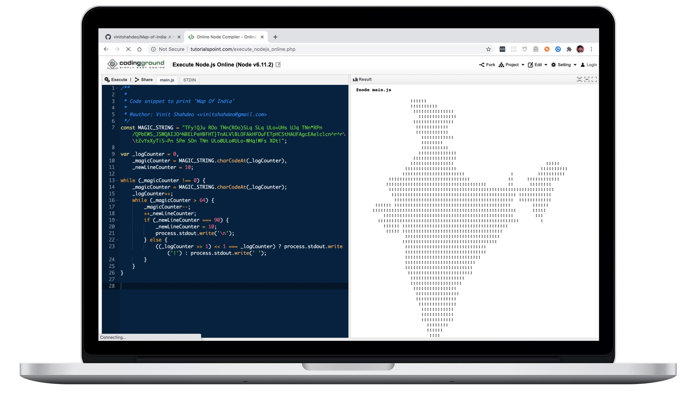

<p align="center"></p>
<h1 align="center">Map of India</h1>
<p align="center">
  <a href="https://github.com/vinitshahdeo/Map-of-India/stargazers"></a>
  <a href="https://github.com/vinitshahdeo/Map-of-India"></a>
  <a href="https://github.com/vinitshahdeo/Map-of-India/blob/master/LICENSE"></a>
</p>
<p align="center"></p>
<h2 align="center"> A Node.js script to generate Map of India in terminal </h2>

### Quick Start :technologist: 

Open your terminal and run `npm start`

### Setup :gear:

```bash
npm install && npm start
```

### Commands :rocket: 

- `npm run draw`: Prints **Map of India** :india: in the terminal

- `npm run wish`: Prints a **Happy Independence Day** message in the terminal

### Explained :building_construction:

```bash
cd src && cat index.js
```

Navigate to `src/` folder and check out [`index.js`](https://github.com/vinitshahdeo/Map-of-India/blob/master/src/index.js).

```javascript

  _   _                                                           
 | | | | __ _ _ __  _ __  _   _                                   
 | |_| |/ _` | '_ \| '_ \| | | |                                  
 |  _  | (_| | |_) | |_) | |_| |                                  
 |_|_|_|\__,_| .__/| .__/ \__, |            _                     
 |_ _|_ __   |_| | |_| _ _|___/__ _ __   __| | ___ _ __   ___ ___ 
  | || '_ \ / _` |/ _ \ '_ \ / _ \ '_ \ / _` |/ _ \ '_ \ / __/ _ \
  | || | | | (_| |  __/ |_) |  __/ | | | (_| |  __/ | | | (_|  __/
 |___|_| |_|\__,_|\___| .__/ \___|_| |_|\__,_|\___|_| |_|\___\___|
 |  _ \  __ _ _   _   |_|                                         
 | | | |/ _` | | | |                                              
 | |_| | (_| | |_| |                                              
 |____/ \__,_|\__, |                                              
              |___/                                               
```

### Dependencies :tada: 

- [Figlet](https://www.npmjs.com/package/figlet): An NPM module used to turn a string into ASCII art.

- [Chalk](https://www.npmjs.com/package/chalk): An NPM module used for terminal string styling.

### Acknowledgement :hugs:

- The image used in this repo is taken from [here](https://www.pngmart.com/files/7/India-Map-Transparent-PNG.png).

- This repository is inspired from a StackOverflow [thread](https://stackoverflow.com/questions/3533348/how-does-this-code-generate-the-map-of-india).

### Author :trophy:

**[Vinit Shahdeo](https://www.linkedin.com/in/vinitshahdeo/)**

[](https://twitter.com/Vinit_Shahdeo)


---

```javascript

if (_.isAwesome(thisRepo)) {
  thisRepo.star(); // thanks in advance :p
}

```

---
